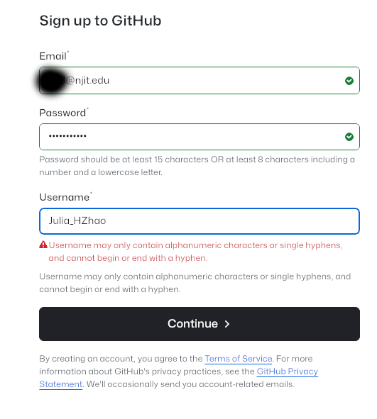
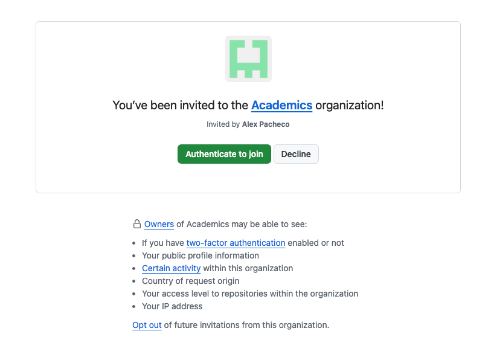

### I received an invite, what do I do next to join NJIT's Github Enterprise Cloud?

1. If you have a Github account, skip to step 2. If you don’t have a GitHub account, please Sign up for a Github account (you can use your personal email or use ucid@njit.edu) by visiting https://github.com/signup:  
     
2. Sign in to GitHub.  
     
3. Add ucid@njit.edu as a secondary email address (Click your avatar in the top right and navigate to Settings > Emails). Skip, if you used ucid@njit.edu or already have this email address attached to your github account
4. You will receive GitHub launch code in the email you signed up for GitHub. Use it for Authentication.   
     
5. Now you are ready to explore GitHub njit-academics or njit-research.  
     
6. Note: **If you have an invite to both njit-academics and njit-research, you need to accept both invites (Step 4) to join NJIT's GEC Org. You do not need to create two github accounts to join both orgs.**

